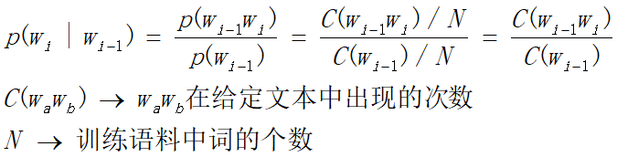

# 基于朴素贝叶斯的文本分类

## 实验目的

基于朴素贝叶斯的文本分类

## 实验内容

>1.根据训练集建立不同类别的一元和二元语法，使用朴素贝叶斯分类模型进行测试集文本分类；
>
>2.语言模型使用困惑度，分类使用准确率，召回率，F1进行性能评估；
>
>3.代码：python为主
>
>4.提交：打包，文件统一命名“学号-姓名-作业2” 实验报告一份，包括实验目的，实验内容，实验原理，实验结果及分析 代码一份（代码不要太大，以自己写的代码为主，不要将数据也打包了）


## 实验原理及实现思路
建立一元语法和二元语法，使用朴素贝叶斯模型进行测试集文本分类。

### step1.分词
分词采用的jieba进行分词，也自己实现了基于词表的逆向最大匹配法进行分词，效果一般但是处理速度太慢了，所以最终还是采用jieba分词实现。
这里简单说明一下两个的实现思路或实现代码。逆向最大匹配是从后到前搜索字符串，然后找到最长的匹配结果输出。

逆向最大匹配
```python
    def segmentation_back(self, sentence):
        max_len = max(len(word) for word in self.words_dic)
        sentence = sentence.strip()

        result = []
        while len(sentence) > 0:
            max_cut_len = min(max_len, len(sentence))
            sub_sentence = sentence[-max_cut_len:]
            while max_cut_len > 0:
                if sub_sentence in self.words_dic:
                    result.append(sub_sentence)
                    break
                elif max_cut_len == 1:
                    if sub_sentence in self.words_dic:
                        result.append(sub_sentence)
                    break
                else:
                    max_cut_len -= 1
                    sub_sentence = sub_sentence[-max_cut_len:]
            sentence = sentence[0:-max_cut_len]
        result.reverse()
        return result
```
使用jieba分词

lcut返回分好词的list形式
```python
raw = jieba.lcut(sentence)
```

### step2.统计并计算概率

#### 一元语法

计算单词wi在类别c中的概率，加上laplace平滑之后的公式如下


对于整个句子 $$ p(x_1,x_2,...,x_n|c)=p(x_1|c)*p(x_2|c)*...*p(x_n|c) $$


一元语法中，因为p(xi|c)相互独立，所以做了去除停用词和二值化处理。为了加速统计，减少遍历次数，也做了打标的操作，table字典中储存形式为[单词，类别为1的概率，类别为0的概率]。

实现代码：

```python
def getWkOfCj(wk, cj):
    '''
    计算某单词wk为类别cj的可能性 p（wk|cj）
    :param wk: 
    :param cj: 
    :return: 
    '''
    # count(w,c)
    cnt_wc = 0
    cnt_c = 0
    cnt_all = 0
    for i in range(len(train_data["label"])):
        cnt_all += sum(train_data["word_count"][i].values())
        if train_data["label"][i] == cj:
            cnt_wc += train_data["word_count"][i][wk]
            cnt_c += sum(train_data["word_count"][i].values())
    p = np.log((cnt_wc + 1) / (cnt_c + len(words_dic)))
    return p

def getProbOfCi(words, i):
    '''
    计算某句子word为类别i的可能性
    :param words: 
    :param i: 
    :return: 
    '''
    label_count = Counter(train_data["label"])
    p = np.log(label_count[i] / sum(label_count.values()))
    for w in words:
        if w not in table.keys():
            # print(table["word"].values)
            pw1 = getWkOfCj(w, 1)
            pw0 = getWkOfCj(w, 0)
            table[w] = [pw1, pw0]
            p += pw1 if i == 1 else pw0
        else:
            line = table[w]
            p += line[0] if i == 1 else line[1]
    return p
```


#### 二元语法：假设下一个词的出现依赖于它前面的一个词

最大似然估计：


加上laplace平滑


而二元语法的朴素贝叶斯公式模型


统计二元语法的概率时，为了方便统计wi wi-1同时出现在类别c中的概率，处理方式为既加入单词词语也加入与上一个的连词，例如”今天 天气 真好“--->START START今天 今天 今天天气 天气 天气真好 真好 真好END END。

同样，在这里为了加速减少遍历，也做了打表的操作，count_table中的储存形式为[词,词在类别1中的频次，词在类别2中的频次]。

实现代码：
```python
def getWkOfCj(wk, wk_1, cj):
    '''
    p(wi|wi-1)=count(wi-1 wi,c)+1/count(wi-1,c)+v
    :param wk: 
    :param wk_1: 
    :param cj: 
    :return: 
    '''
    cnt_ww_1 = 0
    cnt_w_1 = 0
    cnt_ww_0 = 0
    cnt_w_0 = 0

    if wk + wk_1 not in count_table.keys() or wk_1 not in count_table.keys():
        for i in range(len(train_data["label"])):  # 遍历每一行
            if train_data["label"][i] == 1:
                cnt_ww_1 += train_data["word_count"][i][wk + wk_1]  # wkwk-1在第i个句子中出现次数
                cnt_w_1 += train_data["word_count"][i][wk_1]  # wk-1在第i个句子中出现次数
            else:
                cnt_ww_0 += train_data["word_count"][i][wk + wk_1]  # wkwk-1在第i个句子中出现次数
                cnt_w_0 += train_data["word_count"][i][wk_1]  # wk-1在第i个句子中出现次数
        if wk + wk_1 not in count_table.keys():
            count_table[wk + wk_1] = [cnt_ww_1, cnt_ww_0]
        if wk_1 not in count_table.keys():
            count_table[wk_1] = [cnt_w_1, cnt_w_0]
    else:
        cnt_ww_1, cnt_ww_0 = count_table[wk + wk_1]
        cnt_w_1, cnt_w_0 = count_table[wk_1]
    if cj == 1:
        p = np.log((cnt_ww_1 + 1) / (cnt_w_1 + len(words_dic)))  # 平滑
    else:
        p = np.log((cnt_ww_0 + 1) / (cnt_w_0 + len(words_dic)))
    return p

def getProbOfCi(words):
    '''
    一个句子为类别1和0的可能性
    :param words: 某句子
    :param i: 类别i
    :return: p
    '''
    # 类别概率
    label_count = Counter(train_data["label"])
    p0 = np.log(label_count[0] / sum(label_count.values()))
    p1 = np.log(label_count[1] / sum(label_count.values()))

    # 添加首尾标志位
    words.insert(0, "START")
    words.append("END")
    for i in range(len(words) - 1):
        pw0 = getWkOfCj(words[i], words[i + 1], 0)
        pw1 = getWkOfCj(words[i], words[i + 1], 1)
        p0 += pw0
        p1 += pw1
    return p1, p0
```


### step3.分类及评价指标

类别预测已经在step2中的getProbOfCi()函数中实现。

**分类**

评价指标为p，r，f1

P=tp/(tp+fp)

R=tp/(tp+fn)

F1=2PR/(R+P)


实现代码
```python
def calculateARF(result):
    tp, fp, fn, tn = 0, 0, 0, 0
    for i in range(len(result)):
        if test_data["label"][i] == 1:
            if result[i] == 1:
                tp += 1
            else:
                fn += 1
        else:
            if result[i] == 1:
                fp += 1
            else:
                tn += 1
    accuracy = tp / (tp + fp)
    recall = tp / (tp + fn)
    f1 = 2 * accuracy * recall / (accuracy + recall)
    print(accuracy, recall, f1)
```

**语言模型**

困惑度


代码实现：
```python
def calculateComplex2Gram(words):
    '''
    传入一句话，用计算二元语法困惑度
    :param words:
    :return:
    '''
    p = 0
    for i in range(len(words) - 1):
        p += np.log(
            (count_table[words[i] + words[i + 1]][0] + count_table[words[i] + words[i + 1]][1] + 1) / (
                    count_table[words[i]][0] + count_table[words[i]][1] + len(words_dic)))

    complex = np.exp(-p / len(words))
    return complex

def calculateComplex1Gram(words):
    '''
    传入一句话,计算1元语法困惑度
    :param words:
    :return:
    '''
    p = 0
    for i in range(len(words)):
        if words[i] in count_table.keys():
            p += np.log((count_table[words[i]][0] + count_table[words[i]][1] + 1) / words_sum)
        else:
            cnt = 0
            for j in range(len(train_data["label"])):  # 遍历每一行
                cnt += train_data["word_count"][j][words[i]]  # wkwk-1在第i个句子中出现次数
            p += np.log(cnt / words_sum)
    complex = np.exp(-p / len(words))
    return complex

```


## 实验结果

一元语法

|  P   | R  | F1| Complexity|
|  ----  | ----  |----  | ---- |
|0.826|0.821|0.823|1246.928|

二元语法

|  P   | R  | F1| Complexity|
|  ----  | ----  |----  | ---- |
|0.863|0.934|0.897|1095.262|
